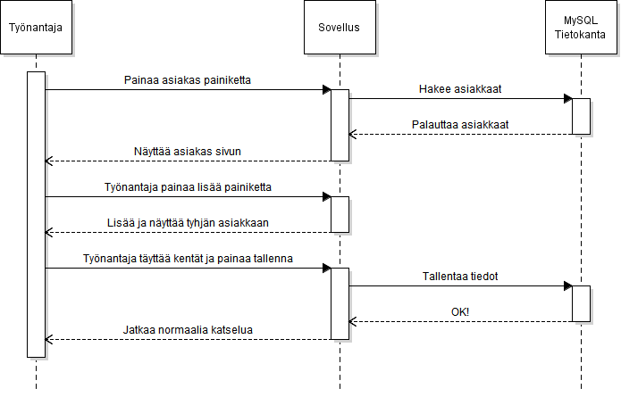

# Työnantaja lisää asiakkaan

## Askeleet  

1. Työnantaja painaa asiakas painiketta  
1.1. Tietokantaan ei saada yhteyttä.  
1.2. Työnantaja käynnistää koneen uudestaan.  
1.2.1. Ongelman jatkuttua, työnantaja käynnistää SQL serverin uudestaan.  
1.2.2. Ongelman jatkuttua, työnantaja ottaa yhteyttä IT-Tukeen.
2. Työnantaja painaa lisää painiketta
3. Ohjelma lisää tyhjän asiakkaan ruutuun
4. Työnantaja täyttää tiedot  
4.1. Tietojapuuttuu  
4.2. Työnantaja lisää puuttuvat tiedot
5. Työnantaja painaa tallenna.  
5.1 Tietokantaan ei saada yhteyttä.  
5.2 Katso kohta 1.2 eteenpäin.
