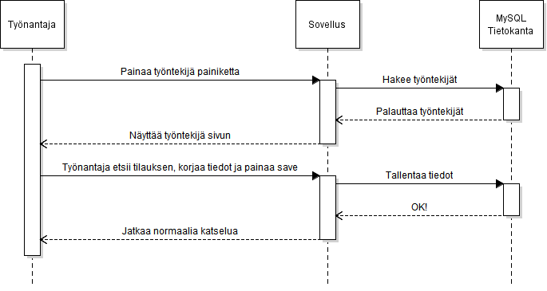

# Työnantaja muokkaa työntekijää

## Askeleet  

1. Työnantaja painaa työntekijöitä painiketta  
1.1. Tietokantaan ei saada yhteyttä.  
1.2. Työnantaja käynnistää koneen uudestaan.  
1.2.1. Ongelman jatkuttua, työnantaja käynnistää SQL serverin uudestaan.  
1.2.2. Ongelman jatkuttua, työnantaja ottaa yhteyttä IT-Tukeen.
2. Työnantaja etsii työntekijän
3. Työnantaja muokkaa haluamansa tiedot ja painaa tallenna
4. Ohjelma varmistaa
5. Työnantaja vastaa kyllä  
5.1 Tietokantaan ei saada yhteyttä.  
5.2 Katso kohta 1.2 eteenpäin.
6. Työnantaja vastaa ei  
6.1 Ohjelma palaa normaaliin tilaan katsomaan työntekijöitä
7. Tiedot tallentuvat tietokantaan
8. Ohjelma palaa normaaliin tilaan katsomaan työntekijöitä
