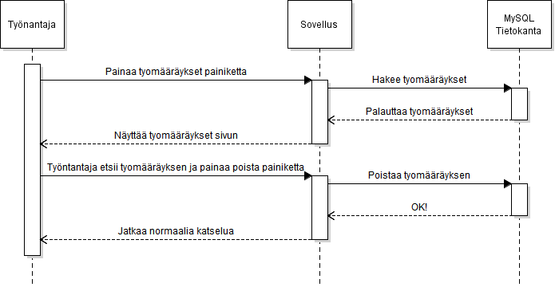

# Työnantaja poistaa työmääräyksen

## Askeleet  

1. Työnantaja painaa työmääräys painiketta  
1.1. Tietokantaan ei saada yhteyttä.  
1.2. Työnantaja käynnistää koneen uudestaan.  
1.2.1. Ongelman jatkuttua, työnantaja käynnistää SQL serverin uudestaan.  
1.2.2. Ongelman jatkuttua, työnantaja ottaa yhteyttä IT-Tukeen.
2. Työnantaja etsii työmääräyksen
3. Työnantaja painaa delete painiketta
4. Ohjelma varmistaa
5. Työnantaja vastaa kyllä  
5.1 Tietokantaan ei saada yhteyttä.  
5.2 Katso kohta 1.2 eteenpäin.
6. Työnantaja vastaa ei  
6.1 Ohjelma palaa normaaliin tilaan katsomaan asiakkaita
