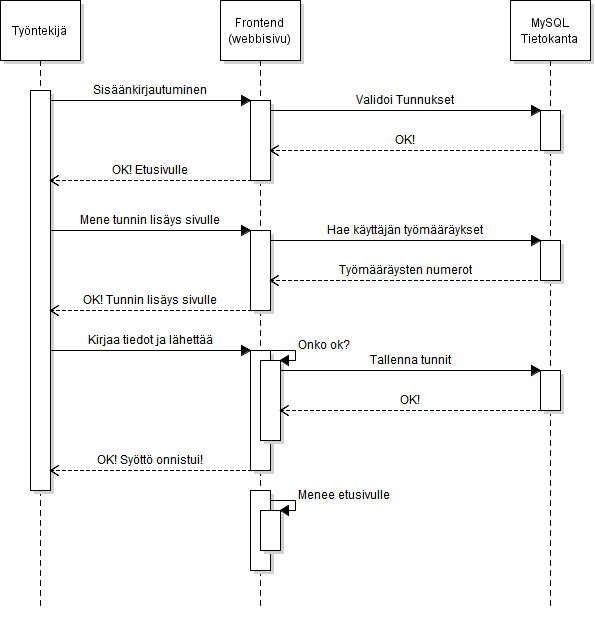

# Työntekijä ilmoittaa tehdyt tunnit

## Askeleet
1. Työntekijä kirjautuu sisälle
2. Työntekijä painaa "lisää tunteja" etusivulta
3. Järjestelmässä aukeaa sivu missä lisätään tunteja.
4. Työntekijä kirjoittaa tunnit
5. Työntekijä kirjoittaa mihin sopimukseen työtunnit menee
6. Työntekijä painaa ok
7. Järjestelmä näyttää vielä tiedot ja pyytää hyväksymään (tunnit, sopimusnumero, asiakkaan nimi)
8. Työntekijä hyväksyy
8.1. Työntekijä huomaa virheen ja hylkää
8.2. Tiivistelmä sulkeutuu eikä tallenna tietoja (palaa 5. kohdan jälkeiseen tilaan mutta ei kuitenkaan mene kohtaan 6.)
8.3. Työntekijä korjaa virheen
8.4. Työntekijä painaa ok
8.5. Järjestelmä menee kohtaan 7.
9. Järjestelmä ilmoittaa onnistuneesta syötöstä
9.1. Syöttö epäonnistuu ja järjestelmä menee kohdan 5. jälkeiseen tilaan, mutta ei kuitenkaan mene kohtaan 6.
10. Järjestelmä menee etusivulle
