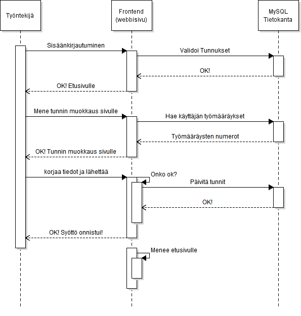

# Työntekijä muokkaa tunteja

## Askeleet
1. Työntekijä kirjautuu sisälle
2. Työntekijä painaa "Muokkaa tunteja" etusivulta
3. Järjestelmässä aukeaa sivu missä näkee tuntimerkinnät.
4. Työntekijä korjaa tunnit
5. Työntekijä korjaa mihin sopimukseen työtunnit menee
6. Työntekijä painaa tallenna
7. Järjestelmä näyttää vielä tiedot ja pyytää hyväksymään (tunnit, sopimusnumero, asiakkaan nimi)
8. Työntekijä hyväksyy
8.1. Työntekijä huomaa virheen ja hylkää
8.2. Tiivistelmä sulkeutuu eikä tallenna tietoja (palaa 5. kohdan jälkeiseen tilaan mutta ei kuitenkaan mene kohtaan 6.)
8.3. Työntekijä korjaa virheen
8.4. Työntekijä painaa tallenna
8.5. Järjestelmä menee kohtaan 7.
9. Järjestelmä ilmoittaa onnistuneesta syötöstä
9.1. Syöttö epäonnistuu ja järjestelmä menee kohdan 5. jälkeiseen tilaan, mutta ei kuitenkaan mene kohtaan 6.
10. Järjestelmä menee etusivulle
